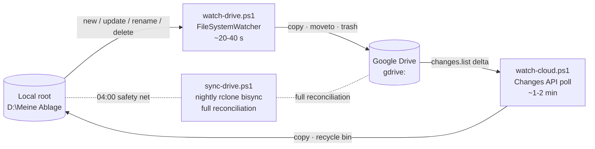

<div align="center">

# drive-sync

**Near-realtime, bidirectional Google Drive sync for Windows — built on [rclone](https://rclone.org).**

[](LICENSE)
[](https://github.com/danielfrey63/drive-sync)
[](https://github.com/PowerShell/PowerShell)
[](https://github.com/rclone/rclone)

Local changes reach the cloud in **under a minute**, cloud changes land locally in **1–2 minutes**, and a nightly `rclone bisync` guarantees full reconciliation — battle-tested on a corpus of **1.6 million files (61 GiB)** that Google's own DriveFS client could no longer handle.

[How it works](#how-it-works) •
[Quick start](#quick-start) •
[Configuration](#configuration) •
[Operations](#operations-and-monitoring) •
[rclone upstream](#relation-to-rclone-upstream)

</div>

---

```text
$ pwsh -File sync-status.ps1
Last run:     2026-08-06 04:00:01  exit=0  27.9 min
Last success: 2026-08-06 04:28:32  (9.8 h ago)
Watcher up:   running (PID 38248)  lastFlush=2026-08-06 15:56:53  up=412 ren=17 del=9
Watcher down: running (PID 28568)  lastFlush=2026-08-06 15:57:35  down=163 recycled=4
```

## Goals

drive-sync is a set of cooperating PowerShell scripts around rclone. In order of importance, it strives to be:

1. **Safe from data loss.** Nothing is ever hard-deleted: deletions go to the Drive trash (30 days) or the Windows recycle bin. Reactive deletes are capped per cycle, uploads never overwrite newer cloud versions (`--update`), and delete storms are deferred to the nightly reconciliation.
2. **Self-healing.** A watchdog restarts silently died watchers, a start-up catch-up uploads everything modified while no watcher was alive, and the nightly full `bisync` reconciles whatever the reactive layer missed — the worst case is always bounded.
3. **Invisible.** Watchers run as windowless scheduled tasks (no console flashing), survive battery operation and reboots, and need zero interaction.
4. **Honest about its dependencies.** A stock rclone release works out of the box; pending rclone features are detected at runtime and used only when available.

## How it works



Three tiers, each covering the blind spots of the one above:

1. **Upload watcher** (`watch-drive.ps1`): a `FileSystemWatcher` batches local events (debounce 15 s / 60 s), uploads via `rclone copy --files-from --no-traverse` (no tree listing), turns renames into server-side `rclone moveto` and verified deletes into Drive-trash moves. On start, a catch-up (`rclone copy --max-age` since the last liveness stamp) closes any coverage gap.
2. **Cloud watcher** (`watch-cloud.ps1`): polls the Drive Changes API with a persisted page token (cheap delta calls, no listing), downloads changed files and moves cloud-trashed files to the recycle bin. A ledger of recent own uploads suppresses echo downloads.
3. **Nightly bisync** (`sync-drive.ps1`, default 04:00): full `rclone bisync` as the guarantee layer — conflicts, cloud-side folder renames, anything missed. Watchers defer their flushes while it runs. Every `EmptyDirCleanupDays` a successful run also prunes empty folder skeletons on the remote (`rclone rmdirs` — bisync only tracks files and never sees directories without any).

### Known limitations

- Windows-only by design (FileSystemWatcher, Task Scheduler, recycle bin).
- Deletes/renames that happen while no watcher runs are only reconciled by the nightly bisync.
- Google-native files (Docs/Sheets/Slides) stay cloud-only (`--drive-skip-gdocs`).

## Quick start

**Requirements:** Windows 10/11, [PowerShell 7](https://github.com/PowerShell/PowerShell) (`scoop install pwsh`), [rclone](https://rclone.org) (`scoop install rclone`), and your own Google OAuth client id (see [howto-google-oauth.md](howto-google-oauth.md) — the shared rclone default id is heavily rate-limited).

```powershell
# 1. rclone remote (type drive, scope drive, your client id/secret)
rclone config              # create remote "gdrive"; then: rclone lsd gdrive:

# 2. adjust config.local.ps1 (copy from config.local.ps1.example) and filters.txt

# 3. one-time baseline - reconciles both sides completely, can take hours
pwsh -File sync-drive.ps1 -Resync

# 4. register the scheduled tasks (nightly bisync + watchers + watchdog)
pwsh -File install-sync-task.ps1
pwsh -File install-watcher-task.ps1

# 5. check
pwsh -File sync-status.ps1
```

All installers are idempotent: re-running updates task definitions without disturbing running watchers.

## Configuration

Defaults live in [`config.ps1`](config.ps1); machine-specific overrides go into `config.local.ps1` (gitignored, see the [example](config.local.ps1.example)).

| Key | Meaning | Default |
| --- | --- | --- |
| `LocalRoot` | local mirror root | `D:\Meine Ablage` |
| `RemoteName` | rclone remote name | `gdrive` |
| `StateDir` | runtime state (logs, locks, cursors) | `%LOCALAPPDATA%\drive-sync` |
| `MaxDeletes` | reactive delete cap per flush; larger storms are journalled and left to the nightly bisync | `50` |
| `JournalDroppedDeletes` | record the paths a `MaxDeletes` storm dropped, so the nightly run can tell a deletion from a new cloud file | `$true` |
| `PollSeconds` | Changes API poll interval | `60` |
| `BisyncDailyAt` | daily start time of the reconciliation bisync (`HH:mm`) | `04:00` |
| `EmptyDirCleanupDays` | days between remote empty-dir cleanups (`rclone rmdirs` after a successful bisync); `0` disables | `30` |
| `EmptyDirCleanupExcludes` | paths the cleanup skips (folders whose only content is an unexportable google-native file would look empty) | `/Google Earth/**` |
| `PacerMinSleep` / `PacerBurst` | Drive pacer tuning (safe with an own client id) | `10ms` / `200` |

Include/exclude rules live in [`filters.txt`](filters.txt) — changing them requires a one-time `sync-drive.ps1 -Resync`.

## Operations and monitoring

`pwsh -File sync-status.ps1` shows the last bisync, watcher liveness (from the PID locks) and transfer counters. All runtime state lives in the configured `StateDir`.

### Forcing a sync from the command line

- **Full reconciliation now** — same as the nightly run, locks, logs and `status.json` included (watchers defer automatically): `pwsh -File sync-drive.ps1`. A full run lists both sides completely, so expect roughly an hour on the baseline corpus.
- **Pull one remote folder down immediately** (never deletes locally, `--update` never overwrites newer local files; add `--dry-run` to preview):

  ```powershell
  rclone copy "gdrive:<subpath>" "D:\Meine Ablage\<subpath>" --update --filter-from "<repo>\filters.txt" --drive-skip-gdocs --modify-window 1s -P
  ```

  Keep `--drive-skip-gdocs` (otherwise google-native docs come down as `.docx`/`.xlsx` exports and get re-uploaded as new files) and the filters file (otherwise excluded paths materialise locally).
- **Usually unnecessary:** the cloud watcher polls the Changes API every `PollSeconds`, so remote edits land locally within 1–2 minutes. If they don't, check `sync-status.ps1` first — a dead watcher or a filtered path is more likely than a missing "force".
- **Avoid** `rclone sync gdrive: <local>`: it mirrors deletions and bypasses every safety net of this setup.

<details>
<summary><b>State files reference</b></summary>

| Path | Content |
| --- | --- |
| `status.json` | last and last successful bisync run |
| `logs\bisync-*.log` | one log per bisync run, newest 30 kept |
| `watcher.log`, `cloud-watcher.log` | watcher logs (rotated), incl. 10-min heartbeats |
| `watcher.lock`, `cloud-watcher.lock`, `sync.lock` | PID locks (single instance / bisync precedence) |
| `watcher-status.json`, `cloud-watcher-status.json` | counters for `sync-status.ps1` |
| `cloud-watcher-pagetoken.txt` | persisted Changes API cursor; deleting it restarts from "now" (the gap is closed by the next bisync) |
| `upload-ledger.txt` | echo control: own uploads of the last 30 min |
| `dropped-deletes-path1.txt`, `dropped-deletes-path2.txt` | paths whose delete a `MaxDeletes` storm dropped, per bisync side; consumed and cleared by the next nightly run |
| `rmdirs-last.txt` | timestamp of the last remote empty-dir cleanup |
| `watcher-lastseen.txt`, `watcher-catchup.log` | liveness stamp of the upload watcher ("everything up to here is uploaded or captured" — only advances while nothing is pending) and the log of the last start-up catch-up |
| `watchdog.log`, `watchdog-pause` | watchdog log; the pause marker suppresses restarts during maintenance (auto-discarded after 6 h; a first line `pid:<n>` keeps it alive as long as that process runs) |
| `bin\rclone.exe` | optional custom rclone build; the watchers prefer it, deleting it falls back to the PATH rclone |

</details>

<details>
<summary><b>Manual task setup (without the installer scripts)</b></summary>

The four tasks can also be created by hand in Task Scheduler (`taskschd.msc`), as the logged-on user, "Run only when user is logged on":

| Task | Trigger | Action | Settings |
| --- | --- | --- | --- |
| `DriveSync watcher` | At log on | `wscript.exe` with arguments `//B //Nologo "<repo>\run-hidden.vbs" "<path>\pwsh.exe" -NoProfile -File "<repo>\watch-drive.ps1"` | no time limit; do not start a new instance if one is running |
| `DriveSync cloud watcher` | At log on | as above, with `watch-cloud.ps1` | as above |
| `DriveSync watchdog` | Once, then repeat every 15 min | as above, with `watchdog.ps1` | time limit 5 min; run as soon as possible after a missed start |
| `DriveSync rclone bisync` | Daily 04:00 | `pwsh.exe` with arguments `-NoProfile -WindowStyle Hidden -File "<repo>\sync-drive.ps1"` | time limit 6 h; only on network; run missed starts when available |

Two hard-won details:

- The `wscript.exe` + `run-hidden.vbs` detour exists because `pwsh -WindowStyle Hidden` still flashes a console window on start. The bisync task deliberately runs **without** the wrapper: only a directly launched process can be killed by its 6 h execution time limit. The backup task (`backup/install-backup-task.ps1`) uses the shared launcher from `ai-toolbox/tools/run-hidden` instead, which waits for pwsh and returns its exit code, so the time limit and the task result keep working there; the watcher tasks could move to it with its `--detach` flag.
- For all four tasks, disable **"Start the task only if the computer is on AC power"** and **"Stop if the computer switches to battery power"**. The PowerShell `New-ScheduledTaskSettingsSet` defaults are silently restrictive — with them, pulling the power cord kills the watchers and task starts on battery hang in the queue.

</details>

<details>
<summary><b>Uninstall</b></summary>

Scripted: `pwsh -File uninstall.ps1` stops both watcher processes and removes all four tasks; `-RemoveState` also deletes the state directory. Manually:

1. Stop the watcher processes: PIDs are in `watcher.lock` and `cloud-watcher.lock` inside the state dir (`Stop-Process -Id <pid>`). If a bisync is running (PID in `sync.lock` alive), let it finish first.
2. Delete the four tasks: `schtasks /Delete /F /TN "DriveSync watcher"` etc. (or in `taskschd.msc`).
3. Optionally delete the state: `Remove-Item -Recurse -Force "$env:LOCALAPPDATA\drive-sync"`.
4. Optionally remove the rclone remote (`rclone config delete gdrive`) and revoke the OAuth access in your Google account.

Uninstalling never touches your data: the local mirror and the cloud content stay untouched, only the synchronisation ends.

</details>

## Off-site backup (restic)

Full setup, restore and troubleshooting notes live in [backup/README.md](backup/README.md); recovery scenarios and the two drills (quarterly restore, and a secrets drill from a second Linux or Windows machine) are in [backup/RESTORE.md](backup/RESTORE.md). The sync is a mirror, not a backup: a deletion or an encrypting malware propagates to the cloud within seconds. `backup/` adds an independent, versioned, client-side encrypted copy of `C:` (user data, no OS/program files) and `D:\Meine Ablage` to a Hetzner Storage Box via [restic](https://restic.net) over SFTP.

- **Transport**: SSH port 23 of the box (OpenSSH), never port 22 (ProFTPD `mod_sftp`, no post-quantum key exchange). The `storagebox` alias in `~/.ssh/config` pins `KexAlgorithms sntrup761x25519-sha512@openssh.com`, so a downgrade to a classical exchange fails instead of silently connecting. restic is pointed at the Microsoft OpenSSH build under `scoop\apps\openssh` (`sftp.command`), because the MSYS `ssh` in `PATH` cannot reach the Windows `ssh-agent` that holds the passphrase-protected key.
- **Encryption at rest**: restic (AES-256, key derived from the repository password in `%LOCALAPPDATA%\restic\storagebox-password.txt`). Losing that password loses the backup — keep a copy in the password manager.
- **Schedule**: every 6 h from 05:00 (after the bisync), elevated for VSS snapshots of locked files. A snapshot is only a tree of pointers into deduplicated chunks, so frequent runs cost little; retention thins them out: every state for 7 days, then 30 daily, then 12 monthly. `prune` and a 2 % `check --read-data-subset` on Sundays.
- **Excludes**: `backup/restic-excludes.txt` — OS, installed programs, package/build caches, WSL/Docker disk images; `.git`, `.claude` and `.env` stay in, unlike the sync filters.

```powershell
# one-time: key in the Windows ssh-agent, repository initialised (see backup/backup-config.ps1)
.\backup\run-backup.ps1 -DryRun            # scan only, shows what would be added
.\backup\run-backup.ps1                    # manual run (VSS only when elevated)
.\backup\install-backup-task.ps1           # from an elevated console: registers the daily task
restic snapshots -o "sftp.command=C:/Users/<you>/scoop/apps/openssh/current/ssh.exe storagebox -s sftp"
```

## Relation to rclone upstream

Everything here rides on [rclone](https://github.com/rclone/rclone) (`bisync`, `copy`, `moveto`, the Drive backend). Building this produced three upstream contributions, currently in flight:

| Contribution | What it does | Used here for |
| --- | --- | --- |
| [PR #9598](https://github.com/rclone/rclone/pull/9598) — `--files-from-strict` (review + testing) | `copy --files-from` fails loudly on missing paths instead of skipping silently | upload batches fail and retry instead of dropping files |
| [Issue #9737](https://github.com/rclone/rclone/issues/9737) / [PR #9741](https://github.com/rclone/rclone/pull/9741) — `--local-use-trash` | local backend deletes to the Windows recycle bin (or freedesktop/macOS trash) | cloud-trash propagation, with a Win32 `SHFileOperation` fallback |
| [Issue #9738](https://github.com/rclone/rclone/issues/9738) — `rclone changes` | first-class change-polling command | would replace most of the custom Changes API code in `watch-cloud.ps1` |

Both watchers detect these flags at runtime and degrade gracefully, so a **stock rclone release works out of the box**. To use the pending features today, build rclone from a branch containing the backports and drop the binary at `<StateDir>\bin\rclone.exe` — the watchers prefer it automatically.

## Background

drive-sync replaced Google's official DriveFS client after it repeatedly failed on this corpus: runaway RAM (11+ GB), a wedged virtual drive that blocked every PowerShell start, and rebuild loops progressing at ~500 items/hour over 2.5 million cloud items. Two full state resets later the pattern was clear — DriveFS does not scale to this corpus. The migration notes live in [HANDOVER-2026-07-30-drivefs-rclone.md](HANDOVER-2026-07-30-drivefs-rclone.md); `analyze-corpus.ps1`, `move-ablage-repos.ps1` and `purge-cloud-moved.ps1` are one-off utilities from that migration, kept for reference.

## Components

| File | Purpose |
| --- | --- |
| `config.ps1` | central configuration (defaults); override per machine via `config.local.ps1` |
| `sync-drive.ps1` | bisync wrapper (lock, logs, `status.json`); `-Resync` re-baselines, `-DryRun` previews |
| `watch-drive.ps1` | upload watcher local → cloud (new/update/rename/delete + start-up catch-up) |
| `watch-cloud.ps1` | download watcher cloud → local (new/update/trash); `-Once` runs a single cycle |
| `watchdog.ps1` | restarts silently died watchers every 15 min |
| `filter-rules.ps1` | shared exclude logic for the watchers, derived from `filters.txt` |
| `run-hidden.vbs` | windowless task launcher (no console window flashing) |
| `install-sync-task.ps1`, `install-watcher-task.ps1` | register the scheduled tasks (idempotent) |
| `uninstall.ps1` | stops the watchers and removes all four tasks (`-RemoveState` also deletes the state dir) |
| `sync-status.ps1` | status overview (last bisync, watcher liveness and counters) |
| `howto-google-oauth.md` | how to create your own Google OAuth client id |
| `backup/run-backup.ps1`, `backup/backup-config.ps1`, `backup/restic-excludes.txt` | restic off-site backup to the Hetzner Storage Box (backup → forget → prune/check) |
| `backup/install-backup-task.ps1` | registers the daily elevated backup task (idempotent) |

## License

[MIT](LICENSE)
